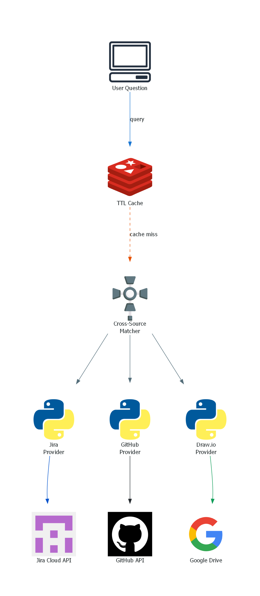
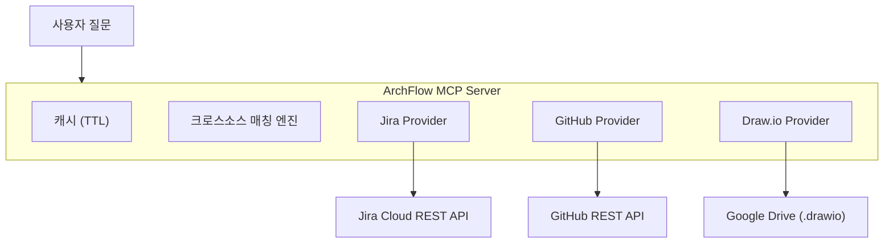

<p align="center">
  
</p>

<h1 align="center">ArchFlow</h1>

<p align="center">
  <strong>Jira + GitHub + Draw.io — 하나의 MCP 서버, 하나의 질문</strong>
</p>

<p align="center">
  
  
  
  
  
</p>

<p align="center">
  <a href="#빠른-시작">빠른 시작</a> ·
  <a href="#도구">도구 (23개)</a> ·
  <a href="#슬래시-명령어">명령어</a> ·
  <a href="#설정-가이드">설정</a> ·
  <a href="#기여-가이드">기여</a> ·
  <a href="./README.md">English</a>
</p>

---

## ArchFlow가 뭔가요?

ArchFlow는 LLM이 **Jira**, **GitHub**, **Draw.io** 다이어그램을 한 번에 조회할 수 있게 해주는 MCP 서버입니다. 탭 전환 없이 스프린트 현황 확인, 이슈-코드 추적, 시스템 아키텍처 탐색이 가능합니다.

### 누가 쓰나요?

| 역할 | 질문 예시 |
|------|----------|
| **대표 / PM** | "이번 스프린트 진행률?" · "이번주 팀 보고서 만들어줘" |
| **신규 팀원** | "우리 시스템 구조 설명해줘" · "뭐부터 봐야 해?" |
| **개발자** | "KAN-123 관련 코드 어디야?" · "인증 쪽 PR 뭐가 있어?" |

### 데모

```
You: "KAN-42 관련 코드 어디에 있어?"

ArchFlow가 3개 소스를 추적합니다:
  ✓ Jira  → KAN-42: "OAuth2 로그인 추가" (진행중, @alice)
  ✓ GitHub → PR #87 "feat: oauth2 login flow" (src/auth/oauth.ts)
  ✓ Draw.io → Auth Service 노드 → API Gateway, User DB와 연결
```

---

## 빠른 시작

### 사전 준비

| 도구 | 확인 방법 | 설치 |
|------|----------|------|
| Python 3.11+ | `python --version` | [python.org](https://python.org) |
| uv | `uv --version` | 아래 참고 |
| Claude Code | 이미 사용 중이면 OK | [claude.ai/code](https://claude.ai/code) |

<details>
<summary><strong>uv 설치</strong></summary>

```bash
# macOS / Linux
curl -LsSf https://astral.sh/uv/install.sh | sh

# Windows (PowerShell)
powershell -ExecutionPolicy ByPass -c "irm https://astral.sh/uv/install.ps1 | iex"
```

</details>

### 자동 설치 (권장)

```bash
# 1. 클론
git clone https://github.com/your-org/archflow.git
cd archflow

# 2. 설치 실행
# macOS / Linux
bash scripts/install.sh

# Windows (PowerShell)
powershell -ExecutionPolicy Bypass -File scripts\install.ps1

# 3. 프로젝트 설정 편집 (Jira 프로젝트, GitHub 레포 지정)
code archflow.config.yml    # 또는 아무 에디터

# 4. Claude Code 재시작 — 끝!
```

> **부분 설정 가능** — GitHub이나 Google Drive 없이도 동작합니다. 연결된 소스만으로 작동합니다.

<details>
<summary><strong>수동 설치 (스크립트 없이)</strong></summary>

스크립트가 안 되거나 직접 설정하고 싶을 때:

```bash
# 1. 의존성 설치
cd archflow
uv sync          # 또는: pip install -e .

# 2. 설정 파일 복사
cp archflow.config.example.yml archflow.config.yml
# archflow.config.yml을 열어 프로젝트/레포 정보 입력
```

**3. MCP 서버 등록** — `~/.claude/.mcp.json` 파일에 추가 (없으면 새로 만들기):

```jsonc
{
  "mcpServers": {
    "archflow": {
      "command": "uv",
      "args": ["--directory", "/absolute/path/to/archflow", "run", "archflow"],
      "env": {
        "PYTHONUNBUFFERED": "1",
        "ARCHFLOW_CONFIG_PATH": "/absolute/path/to/archflow/archflow.config.yml",

        // Jira (Jira 기능 사용 시 필수)
        "JIRA_INSTANCE_URL": "https://your-domain.atlassian.net",
        "JIRA_USER_EMAIL": "you@example.com",
        "JIRA_API_KEY": "your-jira-api-token",

        // GitHub (선택)
        "GITHUB_PERSONAL_ACCESS_TOKEN": "ghp_xxxxxxxxxxxx",

        // Google Drive / Draw.io (선택)
        "GOOGLE_CLIENT_ID": "...",
        "GOOGLE_CLIENT_SECRET": "...",
        "GOOGLE_REFRESH_TOKEN": "..."
      }
    }
  }
}
```

> **MCP 설정 파일 위치**:
> - macOS / Linux: `~/.claude/.mcp.json`
> - Windows: `C:\Users\<사용자명>\.claude\.mcp.json`

**4. 슬래시 명령어 설치** (선택):

```bash
# 스킬 파일을 Claude Code 스킬 디렉토리에 복사
# macOS / Linux
cp -r skills/archflow-* ~/.claude/skills/

# Windows (PowerShell)
Copy-Item -Recurse skills\archflow-* $env:USERPROFILE\.claude\skills\
```

**5. Claude Code 재시작.**

</details>

---

## 도구

### Jira (7개)

| 도구 | 하는 일 |
|------|--------|
| `archflow_jira_get_issue` | 이슈 상세 조회 (댓글, 링크, 서브태스크) |
| `archflow_jira_sprint_status` | 현재 스프린트 상태별 이슈 |
| `archflow_jira_search` | JQL 검색 |
| `archflow_jira_user_workload` | 특정 사용자에게 할당된 이슈 |
| `archflow_jira_component_status` | 컴포넌트별 진행률 (%) |
| `archflow_jira_recent_activity` | 최근 N일 업데이트된 이슈 |
| `archflow_jira_epic_progress` | 에픽 하위 이슈 + 완료율 |

### GitHub (6개)

| 도구 | 하는 일 |
|------|--------|
| `archflow_github_get_pr` | PR 상세 (diff 통계) |
| `archflow_github_list_prs` | PR 목록 (상태/작성자/브랜치 필터) |
| `archflow_github_pr_for_issue` | Jira 이슈 키로 관련 PR 찾기 |
| `archflow_github_recent_commits` | 최근 커밋 목록 |
| `archflow_github_search_code` | 레포에서 코드 검색 |
| `archflow_github_repo_overview` | 레포 요약 (언어, 활동) |

### Draw.io / 아키텍처 (4개)

| 도구 | 하는 일 |
|------|--------|
| `archflow_drawio_list_diagrams` | Google Drive의 .drawio 파일 목록 |
| `archflow_drawio_get_diagram` | 다이어그램 → 노드 + 연결 파싱 |
| `archflow_drawio_search_nodes` | 노드 라벨로 검색 |
| `archflow_drawio_node_connections` | 특정 노드의 인바운드/아웃바운드 연결 |

### 크로스소스 인텔리전스 (5개)

| 도구 | 하는 일 |
|------|--------|
| `archflow_trace_issue` | 이슈 → PR + 코드 + 다이어그램 노드 추적 |
| `archflow_trace_component` | 아키텍처 컴포넌트 → 이슈 + PR + 연결 관계 |
| `archflow_project_overview` | 스프린트 + 아키텍처 + GitHub 활동 종합 |
| `archflow_team_activity` | 주간 팀 보고서 (모든 소스 종합) |
| `archflow_onboarding_context` | 신규 팀원용 프로젝트 전체 맥락 |

### 통합 검색 (1개)

| 도구 | 하는 일 |
|------|--------|
| `archflow_search` | Jira + GitHub + 다이어그램 통합 검색 |

### 각 도구에 필요한 소스

| 도구 그룹 | Jira | GitHub | Draw.io |
|----------|:----:|:------:|:-------:|
| Jira 도구 | **필수** | — | — |
| GitHub 도구 | — | **필수** | — |
| Draw.io 도구 | — | — | **필수** |
| 크로스소스 (추적, 오버뷰) | **필수** | 선택 | 선택 |
| 통합 검색 | 선택 | 선택 | 선택 |

설정 안 된 소스의 도구는 크래시 대신 "not configured" 메시지를 반환합니다.

---

## 슬래시 명령어

설치 후 Claude Code에서 바로 사용:

| 명령어 | 대상 | 사용 예시 |
|--------|------|----------|
| `/status` | 모두 | "인증 기능 어디까지 됐어?" |
| `/trace` | 개발자 | "KAN-123 관련 코드 어디야?" |
| `/arch` | 모두 | "Auth Service가 뭐랑 연결돼있어?" |
| `/onboard` | 신규 팀원 | "이 프로젝트 전체 요약해줘" |
| `/report` | 대표/PM | "이번주 팀 활동 정리해줘" |
| `/search` | 모두 | "인증 관련 전부 찾아줘" |

---

## 설정 가이드

### Step 1: `archflow.config.yml`

설치 스크립트 실행 후 프로젝트 루트의 `archflow.config.yml`을 편집:

```yaml
jira:
  url: "https://your-domain.atlassian.net"
  projects:
    - "KAN"              # Jira 프로젝트 키
  board_id: "1"          # 아래 "board_id 찾는 법" 참고

github:
  repos:
    - "your-org/backend-api"     # owner/repo 형식
  default_branch: "main"

gdrive:
  folder_id: "1AbCdEfG..."      # 아래 "folder_id 찾는 법" 참고
  cache_ttl_minutes: 30
```

#### board_id 찾는 법

1. 브라우저에서 Jira 보드 열기
2. URL 확인:
   ```
   https://your-domain.atlassian.net/jira/software/projects/KAN/boards/1
                                                                       ^
                                                              이 숫자가 board_id
   ```
3. `/boards/` 뒤의 숫자를 복사

#### folder_id 찾는 법 (Google Drive)

1. `.drawio` 파일이 있는 Google Drive 폴더 열기
2. URL 확인:
   ```
   https://drive.google.com/drive/folders/1AbCdEfGhIjKlMnOpQrStUvWxYz
                                          ^^^^^^^^^^^^^^^^^^^^^^^^^^^^
                                          이 문자열이 folder_id
   ```
3. `/folders/` 뒤의 문자열을 복사

### Step 2: 환경 변수 (API 토큰)

설치 스크립트가 자동으로 설정합니다. 수동으로 설정해야 할 경우:

| 변수 | 용도 | 발급 방법 |
|------|------|----------|
| `JIRA_INSTANCE_URL` | Jira | Atlassian URL (예: `https://team.atlassian.net`) |
| `JIRA_USER_EMAIL` | Jira | Atlassian 이메일 |
| `JIRA_API_KEY` | Jira | [Jira 토큰 발급 →](#jira-api-토큰) |
| `GITHUB_PERSONAL_ACCESS_TOKEN` | GitHub | [GitHub 토큰 발급 →](#github-personal-access-token) |
| `GOOGLE_CLIENT_ID` | Draw.io | [Google OAuth 설정 →](#google-drive-oauth) |
| `GOOGLE_CLIENT_SECRET` | Draw.io | Google Cloud Console |
| `GOOGLE_REFRESH_TOKEN` | Draw.io | OAuth 인증 흐름 |

> **별칭**: `JIRA_URL`, `JIRA_EMAIL`, `JIRA_API_TOKEN`도 사용 가능합니다 (설치 스크립트는 `JIRA_INSTANCE_URL` / `JIRA_USER_EMAIL` / `JIRA_API_KEY` 사용).
>
> **Google Drive**: 3개 변수 (`CLIENT_ID`, `CLIENT_SECRET`, `REFRESH_TOKEN`)가 **모두** 설정되어야 합니다. 하나라도 빠지면 Draw.io 기능이 비활성화됩니다.

### 토큰 발급 가이드

<details>
<summary><strong>Jira API 토큰</strong> (2분)</summary>

1. https://id.atlassian.com/manage-profile/security/api-tokens 접속
2. **"API 토큰 만들기"** → 라벨 입력 (예: `archflow`)
3. 토큰 복사 → 설치 스크립트 또는 `.mcp.json`에 붙여넣기

</details>

<details>
<summary><strong>GitHub Personal Access Token</strong> (2분)</summary>

1. https://github.com/settings/tokens?type=beta 접속
2. **"Generate new token"** → 이름: `archflow`
3. 권한 → Repository: **Contents**, **Pull requests**, **Metadata** (모두 Read-only)
4. 토큰 복사 → 설치 스크립트 또는 `.mcp.json`에 붙여넣기

</details>

<details>
<summary><strong>Google Drive OAuth</strong> (10분 — Draw.io 사용 시만)</summary>

1. [Google Cloud Console](https://console.cloud.google.com/) → 프로젝트 생성/선택
2. **API 및 서비스 > 라이브러리** → **Google Drive API** 사용 설정
3. **사용자 인증 정보** → **OAuth 클라이언트 ID** 만들기 (데스크톱 앱)
4. **클라이언트 ID**와 **클라이언트 보안 비밀번호** 복사
5. [OAuth Playground](https://developers.google.com/oauthplayground/)에서 Refresh Token 받기:
   - 설정 → "Use your own OAuth credentials" → Client ID/Secret 입력
   - Step 1: `drive.readonly` 스코프 선택 → Authorize
   - Step 2: Exchange → **Refresh token** 복사

</details>

---

## 아키텍처

<p align="center">
  
</p>

**토큰 절감**: 모든 API 응답은 TTL 캐시. 같은 질문 반복 시 API 호출 0.

<details>
<summary>Mermaid (텍스트 버전)</summary>



</details>

---

## 문제 해결

### 설정 체크리스트

설정이 정상인지 확인하는 명령어:

```bash
# 1. Python 버전 확인 (3.11+ 필요)
python --version

# 2. MCP 설정이 유효한 JSON인지 확인
python -m json.tool ~/.claude/.mcp.json          # macOS/Linux
python -m json.tool %USERPROFILE%\.claude\.mcp.json   # Windows

# 3. 서버가 에러 없이 시작되는지 확인
cd archflow && uv run archflow
# (Ctrl+C로 종료 — 에러 없으면 정상)
```

### 자주 묻는 문제

| 증상 | 원인 | 해결 |
|------|------|------|
| Claude Code에서 서버 안 보임 | MCP 설정 미등록 | 설치 스크립트 재실행, 또는 `.mcp.json`에 수동 추가 ([수동 설치 참고](#수동-설치-스크립트-없이)) |
| `"Jira not configured"` | `JIRA_INSTANCE_URL` 환경변수 누락 | `.mcp.json` → `archflow.env`에 Jira 변수 3개 모두 있는지 확인 |
| `"GitHub not configured"` | `GITHUB_PERSONAL_ACCESS_TOKEN` 누락 | `.mcp.json` → `archflow.env`에 추가 |
| Draw.io 파일 안 보임 | `folder_id` 오류 또는 OAuth 토큰 누락 | config의 `folder_id` 확인 ([찾는 법 →](#folder_id-찾는-법-google-drive)) + Google 환경변수 3개 확인 |
| 데이터가 오래됨 | API 응답 캐시됨 | 기본 TTL 30분. Claude Code 재시작으로 캐시 초기화 |
| GitHub rate limit | Search API 30회/분 제한 | 잠시 후 재시도 — 결과는 자동 캐시됨 |
| `bash: command not found` (Windows) | PowerShell에서 bash 스크립트 실행 시도 | `powershell -ExecutionPolicy Bypass -File scripts\install.ps1` 사용 |
| 서버 시작 시 `SyntaxError` | Python 버전 부족 | `python --version` 확인 — 3.11+ 필요 |
| MCP 설정 파싱 에러 | `.mcp.json` JSON 문법 오류 | `python -m json.tool ~/.claude/.mcp.json` 으로 에러 위치 확인 |

---

## 기여 가이드

### 프로젝트 구조

```
src/archflow/
├── server.py          # MCP 서버 엔트리포인트 + lifespan
├── clients/           # HTTP 클라이언트
│   ├── jira_client.py       # Jira REST API 호출
│   ├── github_client.py     # GitHub REST API 호출
│   └── gdrive_client.py     # Google Drive API 호출
├── providers/         # 소스별 비즈니스 로직
│   ├── jira_provider.py     # Jira 데이터 가공
│   ├── github_provider.py   # GitHub 데이터 가공
│   └── drawio_provider.py   # Draw.io XML 파싱 + 데이터 가공
├── core/              # 공통 인프라
│   ├── config.py            # YAML 설정 로더
│   ├── cache.py             # TTL 캐시
│   ├── matcher.py           # 크로스소스 매칭 엔진
│   └── models.py            # Pydantic 모델
└── tools/             # MCP 도구 등록 (23개)
    ├── jira_tools.py        # Jira 도구 7개
    ├── github_tools.py      # GitHub 도구 6개
    ├── drawio_tools.py      # Draw.io 도구 4개
    ├── cross_tools.py       # 크로스소스 도구 5개
    └── search_tools.py      # 통합 검색 도구 1개
```

### 개발 환경 설정

```bash
uv sync --dev                          # 개발 의존성 설치
uv run python -m pytest tests/ -v      # 테스트 실행
uv run ruff check src/                 # 린트
```

### 어디서부터 봐야 하나?

| 하고 싶은 것 | 볼 파일 |
|-------------|---------|
| 새 Jira 도구 추가 | `src/archflow/tools/jira_tools.py` |
| 새 GitHub 도구 추가 | `src/archflow/tools/github_tools.py` |
| 소스 간 매칭 로직 수정 | `src/archflow/core/matcher.py` |
| 새 데이터 소스 추가 | `clients/X_client.py` + `providers/X_provider.py` + `tools/X_tools.py` 생성 |
| 캐시 동작 변경 | `src/archflow/core/cache.py` |

### 커밋 컨벤션

```
<type>: <description>

타입: feat | fix | refactor | docs | test | chore | perf | ci
```

---

## 라이선스

MIT — [LICENSE](LICENSE) 참고
