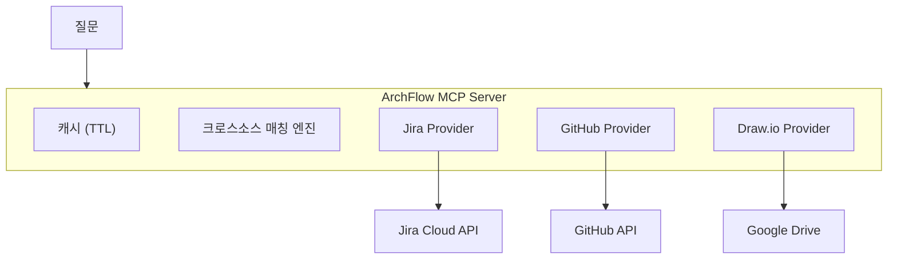

<p align="center">
  
</p>

<h1 align="center">ArchFlow</h1>

<p align="center">
  <strong>Jira + GitHub + Draw.io 정보를 Claude Code에서 한번에 조회</strong>
</p>

<p align="center">
  
  
  
  
</p>

<p align="center">
  <a href="#-설치하기">설치하기</a> ·
  <a href="#-이런-걸-할-수-있어요">활용 예시</a> ·
  <a href="#-슬래시-커맨드">커맨드</a> ·
  <a href="#-설정-가이드">설정</a> ·
  <a href="#contributing">Contributing</a> ·
  <a href="./README.md">English</a>
</p>

---

## 이게 뭔가요?

ArchFlow는 [MCP (Model Context Protocol)](https://modelcontextprotocol.io/) 서버입니다.
쉽게 말하면, **Claude Code에 Jira/GitHub/Draw.io 조회 기능을 추가해주는 플러그인**이에요.

설치하면 Claude Code 안에서 이렇게 쓸 수 있습니다:

```
You: "KAN-42 관련 코드 어디야?"

ArchFlow:
  Jira   → KAN-42: "OAuth2 로그인 추가" (진행 중, @alice)
  GitHub → PR #87 "feat: oauth2 login flow" (src/auth/oauth.ts)
  Draw.io → Auth Service → API Gateway, User DB와 연결됨
```

Jira 열고, GitHub 열고, 다이어그램 열고 할 필요 없이 **한 번에 다 나옵니다.**

---

## 📦 설치하기

### 먼저 확인할 것

- **Python 3.11 이상** 설치되어 있어야 합니다 — [다운로드](https://www.python.org/downloads/)
  - 확인 방법: 터미널에서 `python --version` 입력
- **Claude Code**가 이미 설치되어 있어야 합니다
- **Jira Cloud 계정** (필수) — GitHub, Google Drive는 나중에 추가해도 됩니다

### Step 1: 설치

터미널(또는 명령 프롬프트)을 열고 아래 중 하나를 실행:

```bash
pip install archflow-hub          # 기본
# 또는
uv pip install archflow-hub      # uv 사용자 (10~100배 빠름)
# 또는
pipx install archflow-hub        # 글로벌 환경 격리 설치
```

> `pip`이 안 되면 `pip3 install archflow-hub` 또는 `python -m pip install archflow-hub`을 시도하세요.

### Step 2: 초기 설정

```bash
archflow init
```

이 명령어를 실행하면 터미널에서 하나씩 물어봅니다:

```
1. Jira URL          → https://your-team.atlassian.net  (우리 팀 Jira 주소)
2. Jira 이메일        → you@company.com
3. Jira API 토큰      → ********  (아래에서 발급 방법 설명)
4. Jira 프로젝트 키    → KAN  (Jira 보드 왼쪽 상단에 보이는 영문 키)
5. Jira 보드 ID       → 1  (기본값, 아래에서 찾는 법 설명)
6. GitHub 토큰        → (선택사항 — Enter 누르면 스킵)
7. Google Drive 설정   → (선택사항 — Enter 누르면 스킵)
```

입력하면 자동으로:
- API 연결이 되는지 검증
- 설정 파일 생성 (`~/.archflow/config.yml`)
- Claude Code에 MCP 서버 등록
- 슬래시 커맨드 6개 설치 (`/archflow-status`, `/archflow-trace`, `/archflow-arch`, `/archflow-onboard`, `/archflow-report`, `/archflow-search`)

### Step 3: Claude Code 재시작

Claude Code를 **완전히 종료했다가 다시 실행**하세요. 그리고:

```
/archflow-status
```

결과가 나오면 설치 완료!

### 설치 잘 됐는지 확인

```bash
archflow doctor
```

어디가 연결되고 어디가 안 되는지 알려줍니다.

### 설치 방식이 여러 개인데?

| 방식 | 설명 | 언제 쓰나 |
|------|------|----------|
| `pip install archflow-hub` | 기본 pip 설치 | uv를 안 쓰는 경우 |
| `uv pip install archflow-hub` | uv로 설치 (10~100배 빠름) | [uv](https://docs.astral.sh/uv/) 사용자 |
| `pipx install archflow-hub` | 글로벌 환경 격리 설치 | CLI 도구를 깔끔하게 관리하고 싶을 때 |
| `uvx archflow-hub` | 설치 없이 임시 실행 (npx와 비슷) | Claude Code가 MCP 서버를 자동으로 실행할 때 (직접 쓸 일 없음) |

> 위 방법 중 아무거나 하나로 설치하고 `archflow init`만 실행하면 됩니다. 이후 Claude Code가 알아서 서버를 실행합니다.

---

### 🔑 API 토큰 발급 방법

<details>
<summary><strong>Jira API 토큰 발급</strong> (2분, 필수)</summary>

1. https://id.atlassian.com/manage-profile/security/api-tokens 접속
2. **"Create API token"** 클릭
3. 라벨 입력 (예: `archflow`) → **Create**
4. 생성된 토큰 복사 → `archflow init`에서 붙여넣기

</details>

<details>
<summary><strong>GitHub Personal Access Token 발급</strong> (2분, 선택)</summary>

1. https://github.com/settings/tokens?type=beta 접속
2. **"Generate new token"** 클릭
3. 이름: `archflow`
4. **Repository permissions** → 아래 3개를 **Read-only**로 설정:
   - Contents
   - Pull requests
   - Metadata
5. 생성된 토큰 복사 → `archflow init`에서 붙여넣기

</details>

<details>
<summary><strong>Google Drive OAuth 설정</strong> (10분, Draw.io 사용할 때만)</summary>

1. [Google Cloud Console](https://console.cloud.google.com/) → 프로젝트 생성 또는 선택
2. **APIs & Services > Library** → **Google Drive API** 활성화
3. **Credentials** → **Create Credentials** → **OAuth client ID** (Desktop app)
4. **Client ID**와 **Client Secret** 복사
5. [OAuth Playground](https://developers.google.com/oauthplayground/)에서 Refresh Token 발급:
   - 오른쪽 상단 설정(톱니바퀴) → "Use your own OAuth credentials" 체크 → Client ID/Secret 입력
   - Step 1: `drive.readonly` 선택 → Authorize
   - Step 2: Exchange → **Refresh token** 복사
6. `archflow init`에서 3개 모두 입력

</details>

<details>
<summary><strong>Jira board_id 찾는 법</strong></summary>

Jira 보드를 브라우저에서 열고 URL을 보세요:
```
https://your-team.atlassian.net/jira/software/projects/KAN/boards/1
                                                                  ^
                                                            이 숫자가 board_id
```

</details>

<details>
<summary><strong>Google Drive folder_id 찾는 법</strong></summary>

`.drawio` 파일이 있는 Google Drive 폴더를 열고 URL을 보세요:
```
https://drive.google.com/drive/folders/1AbCdEfGhIjKlMnOpQrStUvWxYz
                                       ^^^^^^^^^^^^^^^^^^^^^^^^^^^^
                                       이 부분이 folder_id
```

</details>

---

## 💡 이런 걸 할 수 있어요

### 누구나

| 이렇게 물어보세요 | ArchFlow가 하는 일 |
|-------------------|-------------------|
| "스프린트 현황 어때?" | Jira에서 현재 스프린트 이슈를 상태별로 정리, 진행률 표시 |
| "Redis 관련된 거 전부 찾아줘" | Jira 이슈 + GitHub 코드 + 다이어그램 노드 통합 검색 |
| "Auth Service랑 연결된 게 뭐야?" | Draw.io 다이어그램에서 연결 관계 파싱 |

### 개발자

| 이렇게 물어보세요 | ArchFlow가 하는 일 |
|-------------------|-------------------|
| "KAN-42 코드 어디야?" | Jira 이슈 → GitHub PR → 코드 파일 → 아키텍처 노드 추적 |
| "auth 관련 PR 보여줘" | GitHub PR을 키워드, 브랜치, Jira 키로 검색 |
| "이번 주 팀이 뭐 했어?" | 커밋 + PR + Jira 상태 변경을 하나로 종합 |

### PM / 신규 팀원

| 이렇게 물어보세요 | ArchFlow가 하는 일 |
|-------------------|-------------------|
| "주간 보고서 만들어줘" | 누가 뭘 했는지, 뭐가 진행 중인지, 뭐가 막혀있는지 정리 |
| "프로젝트 처음인데 설명해줘" | 스프린트 + 아키텍처 + 레포 구조 + 주요 이슈 종합 |
| "인증 에픽 얼마나 됐어?" | 에픽 하위 이슈 진행률, 상태별 분류 |

---

## ⚡ 슬래시 커맨드

Claude Code에서 `/`를 입력하면 바로 쓸 수 있습니다:

| 커맨드 | 설명 | 예시 |
|--------|------|------|
| `/archflow-status` | 진행 상황 확인 | "인증 기능 어디까지 됐어?" |
| `/archflow-trace` | 이슈 → 코드 추적 | "KAN-123 관련 PR 찾아줘" |
| `/archflow-arch` | 아키텍처 조회 | "Auth Service 연결 관계 보여줘" |
| `/archflow-onboard` | 프로젝트 개요 | "이 프로젝트 전체 맥락 알려줘" |
| `/archflow-report` | 팀 활동 보고서 | "이번 주 팀 리포트" |
| `/archflow-search` | 통합 검색 | "Redis 관련된 거 전부" |

> 슬래시 커맨드 없이 자연어로 물어봐도 됩니다. Claude가 알아서 ArchFlow 도구를 사용합니다.

---

## MCP 도구 (23개)

ArchFlow는 내부적으로 23개의 MCP 도구를 제공합니다. 슬래시 커맨드가 이 도구들을 조합해서 동작합니다:

| 그룹 | 개수 | 도구 |
|------|:----:|------|
| **Jira** | 7 | `get_issue`, `sprint_status`, `search`, `user_workload`, `component_status`, `recent_activity`, `epic_progress` |
| **GitHub** | 6 | `get_pr`, `list_prs`, `pr_for_issue`, `recent_commits`, `search_code`, `repo_overview` |
| **Draw.io** | 4 | `list_diagrams`, `get_diagram`, `search_nodes`, `node_connections` |
| **크로스소스** | 5 | `trace_issue`, `trace_component`, `project_overview`, `team_activity`, `onboarding_context` |
| **통합 검색** | 1 | `search` (모든 소스 동시 검색) |

모든 도구는 `archflow_` 접두사가 붙습니다 (예: `archflow_jira_get_issue`).

### 소스별 필요 조건

| 도구 그룹 | Jira | GitHub | Draw.io |
|----------|:----:|:------:|:-------:|
| Jira 도구 | **필수** | — | — |
| GitHub 도구 | — | **필수** | — |
| Draw.io 도구 | — | — | **필수** |
| 크로스소스 | **필수** | 선택 | 선택 |
| 통합 검색 | 선택 | 선택 | 선택 |

설정 안 된 소스의 도구는 에러 대신 "not configured" 메시지를 반환합니다.

---

## 🔧 설정 가이드

### 설정 파일

`archflow init`이 자동 생성합니다. 나중에 수정하려면 직접 편집:

```yaml
# ~/.archflow/config.yml

jira:
  url: "https://your-team.atlassian.net"
  projects: ["KAN"]          # 프로젝트 키 (여러 개 가능)
  board_id: "1"              # 스프린트 보드 ID

github:
  repos: ["your-org/repo"]   # owner/repo 형식
  default_branch: "main"

gdrive:
  folder_id: "1AbCdEfG..."   # .drawio 파일이 있는 폴더
  cache_ttl_minutes: 30       # API 캐시 시간 (분)
```

<details>
<summary><strong>수동 설치 (archflow init 없이)</strong></summary>

```bash
pip install archflow-hub   # 또는: uv pip install archflow-hub

claude mcp add-json --scope user archflow '{
  "type": "stdio",
  "command": "uvx",
  "args": ["archflow-hub"],
  "env": {
    "PYTHONUNBUFFERED": "1",
    "ARCHFLOW_CONFIG_PATH": "~/.archflow/config.yml",
    "JIRA_URL": "https://your-domain.atlassian.net",
    "JIRA_EMAIL": "you@example.com",
    "JIRA_API_TOKEN": "your-jira-api-token",
    "GITHUB_PERSONAL_ACCESS_TOKEN": "ghp_xxxxxxxxxxxx"
  }
}'
```

> `claude mcp add` (add-json 없이)는 환경변수를 전달하지 **않습니다**.

</details>

---

## Architecture

<p align="center">
  
</p>



모든 API 응답은 캐시됩니다 (기본 30분). 같은 질문을 반복하면 API 호출 0.

---

## 🔥 문제 해결

```bash
archflow doctor    # 모든 연결 상태를 한번에 점검
```

| 문제 | 해결 |
|------|------|
| Claude Code에서 ArchFlow가 안 보임 | `archflow init` 다시 실행 → Claude Code 재시작 |
| "Jira not configured" | Jira 토큰 누락 → `archflow init` 재실행 |
| "GitHub not configured" | GitHub 토큰을 스킵했거나 만료됨 → 토큰 재발급 후 init |
| Draw.io 파일이 안 나옴 | `folder_id` 확인 + Google OAuth 3개 값 모두 입력했는지 확인 |
| 데이터가 옛날 것 | 캐시 때문 (기본 30분) → Claude Code 재시작하면 초기화 |
| GitHub 요청 제한 | 검색 API는 분당 30회 제한 → 잠시 기다리면 캐시가 해결 |

---

## Contributing

### Project Structure

```
src/archflow/
├── server.py              # MCP 서버 + 도구 등록
├── cli.py                 # CLI: init, doctor, serve
├── cli_init.py            # 설치 마법사 (토큰 + MCP + 슬래시 커맨드)
├── cli_doctor.py          # 연결 진단
├── clients/               # API 클라이언트 (Jira, GitHub, Google Drive)
├── providers/             # 소스별 비즈니스 로직
├── core/                  # 설정, 캐시, 매칭, 모델
├── tools/                 # MCP 도구 23개
└── skills/                # 슬래시 커맨드 6개
```

### Dev Setup

```bash
git clone https://github.com/Juhwan01/ArchFlow.git
cd ArchFlow
uv sync --dev
uv run python -m pytest tests/ -v
uv run ruff check src/
```

### Commit Convention

```
<type>: <description>
Types: feat | fix | refactor | docs | test | chore | perf | ci
```

---

## License

MIT — [LICENSE](LICENSE) 참고
