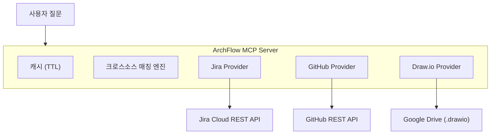

<p align="center">
  
</p>

<h1 align="center">ArchFlow</h1>

<p align="center">
  <strong>Jira + GitHub + Draw.io — 하나의 MCP 서버, 하나의 질문</strong>
</p>

<p align="center">
  
  
  
  
  
</p>

<p align="center">
  <a href="#빠른-시작">빠른 시작</a> ·
  <a href="#도구">도구 (23개)</a> ·
  <a href="#슬래시-명령어">명령어</a> ·
  <a href="#설정">설정</a> ·
  <a href="#기여-가이드">기여 가이드</a> ·
  <a href="./README.md">English</a>
</p>

---

## ArchFlow가 뭔가요?

ArchFlow는 LLM이 **Jira**, **GitHub**, **Draw.io** 다이어그램을 한 번에 조회할 수 있게 해주는 MCP 서버입니다. 탭 전환 없이 스프린트 현황 확인, 이슈-코드 추적, 시스템 아키텍처 탐색이 가능합니다.

### 누가 쓰나요?

| 역할 | 질문 예시 |
|------|----------|
| **대표 / PM** | "이번 스프린트 진행률?" · "이번주 팀 보고서 만들어줘" |
| **신규 팀원** | "우리 시스템 구조 설명해줘" · "뭐부터 봐야 해?" |
| **개발자** | "KAN-123 관련 코드 어디야?" · "인증 쪽 PR 뭐가 있어?" |

### 데모

```
You: "KAN-42 관련 코드 어디에 있어?"

ArchFlow가 3개 소스를 추적합니다:
  ✓ Jira  → KAN-42: "OAuth2 로그인 추가" (진행중, @alice)
  ✓ GitHub → PR #87 "feat: oauth2 login flow" (src/auth/oauth.ts)
  ✓ Draw.io → Auth Service 노드 → API Gateway, User DB와 연결
```

---

## 빠른 시작

> **사전 준비**: Python 3.11+ · [uv](https://docs.astral.sh/uv/) · Claude Code CLI

```bash
# 1. 클론 & 설치
git clone https://github.com/your-org/archflow.git
cd archflow
bash scripts/install.sh    # 대화형 — API 크레덴셜을 물어봅니다

# 2. 프로젝트 설정 편집
code archflow.config.yml   # 또는 아무 에디터

# 3. Claude Code 재시작 — 끝!
```

설치 스크립트가 처리하는 것: 의존성 설치, 크레덴셜 설정, MCP 등록, 슬래시 명령어 등록.

> **부분 설정 가능** — GitHub이나 Google Drive 없이도 동작합니다. 연결된 소스만으로 작동합니다.

---

## 도구

### Jira (7개)

| 도구 | 하는 일 |
|------|--------|
| `archflow_jira_get_issue` | 이슈 상세 조회 (댓글, 링크, 서브태스크) |
| `archflow_jira_sprint_status` | 현재 스프린트 상태별 이슈 |
| `archflow_jira_search` | JQL 검색 |
| `archflow_jira_user_workload` | 특정 사용자에게 할당된 이슈 |
| `archflow_jira_component_status` | 컴포넌트별 진행률 (%) |
| `archflow_jira_recent_activity` | 최근 N일 업데이트된 이슈 |
| `archflow_jira_epic_progress` | 에픽 하위 이슈 + 완료율 |

### GitHub (6개)

| 도구 | 하는 일 |
|------|--------|
| `archflow_github_get_pr` | PR 상세 (diff 통계) |
| `archflow_github_list_prs` | PR 목록 (상태/작성자/브랜치 필터) |
| `archflow_github_pr_for_issue` | Jira 이슈 키로 관련 PR 찾기 |
| `archflow_github_recent_commits` | 최근 커밋 목록 |
| `archflow_github_search_code` | 레포에서 코드 검색 |
| `archflow_github_repo_overview` | 레포 요약 (언어, 활동) |

### Draw.io / 아키텍처 (4개)

| 도구 | 하는 일 |
|------|--------|
| `archflow_drawio_list_diagrams` | Google Drive의 .drawio 파일 목록 |
| `archflow_drawio_get_diagram` | 다이어그램 → 노드 + 연결 파싱 |
| `archflow_drawio_search_nodes` | 노드 라벨로 검색 |
| `archflow_drawio_node_connections` | 특정 노드의 인바운드/아웃바운드 연결 |

### 크로스소스 인텔리전스 (5개)

| 도구 | 하는 일 |
|------|--------|
| `archflow_trace_issue` | 이슈 → PR + 코드 + 다이어그램 노드 추적 |
| `archflow_trace_component` | 아키텍처 컴포넌트 → 이슈 + PR + 연결 관계 |
| `archflow_project_overview` | 스프린트 + 아키텍처 + GitHub 활동 종합 |
| `archflow_team_activity` | 주간 팀 보고서 (모든 소스 종합) |
| `archflow_onboarding_context` | 신규 팀원용 프로젝트 전체 맥락 |

### 통합 검색 (1개)

| 도구 | 하는 일 |
|------|--------|
| `archflow_search` | Jira + GitHub + 다이어그램 통합 검색 |

---

## 슬래시 명령어

설치 후 Claude Code에서 바로 사용:

| 명령어 | 대상 | 사용 예시 |
|--------|------|----------|
| `/status` | 모두 | "인증 기능 어디까지 됐어?" |
| `/trace` | 개발자 | "KAN-123 관련 코드 어디야?" |
| `/arch` | 모두 | "Auth Service가 뭐랑 연결돼있어?" |
| `/onboard` | 신규 팀원 | "이 프로젝트 전체 요약해줘" |
| `/report` | 대표/PM | "이번주 팀 활동 정리해줘" |
| `/search` | 모두 | "인증 관련 전부 찾아줘" |

---

## 설정

### `archflow.config.yml`

```yaml
jira:
  url: "https://your-domain.atlassian.net"
  projects:
    - "KAN"              # 여러 프로젝트 지원
    - "FRONT"
  board_id: "1"

github:
  repos:
    - "your-org/backend-api"     # 여러 레포 지원
    - "your-org/frontend-web"
  default_branch: "main"

gdrive:
  folder_id: "1abc123..."       # .drawio 파일이 있는 Google Drive 폴더
  cache_ttl_minutes: 30

matching:
  explicit:                      # 수동 매핑: 다이어그램 노드 → Jira/GitHub
    - diagram_node: "Auth Service"
      jira_component: "authentication"
      github_path_prefix: "src/auth/"
  auto_match:
    enabled: true
    strategy: "fuzzy"            # exact | fuzzy | contains
    min_score: 0.7
```

### 환경 변수

| 변수 | 필요한 경우 | 발급처 |
|------|-----------|--------|
| `JIRA_URL` | Jira 기능 사용 시 | Atlassian URL |
| `JIRA_EMAIL` | Jira 기능 사용 시 | 본인 이메일 |
| `JIRA_API_TOKEN` | Jira 기능 사용 시 | [토큰 발급 →](#jira-api-토큰) |
| `GITHUB_PERSONAL_ACCESS_TOKEN` | GitHub 기능 사용 시 | [토큰 발급 →](#github-personal-access-token) |
| `GOOGLE_CLIENT_ID` | Draw.io 기능 사용 시 | [OAuth 설정 →](#google-drive-oauth) |
| `GOOGLE_CLIENT_SECRET` | Draw.io 기능 사용 시 | Google Cloud Console |
| `GOOGLE_REFRESH_TOKEN` | Draw.io 기능 사용 시 | OAuth 인증 흐름 |

> `JIRA_INSTANCE_URL`, `JIRA_USER_EMAIL`, `JIRA_API_KEY`도 별칭으로 사용 가능합니다.
> 설치 스크립트가 기존 Claude Code의 Jira 설정을 자동 감지합니다.

### 토큰 발급 가이드

<details>
<summary><strong>Jira API 토큰</strong> (2분)</summary>

1. https://id.atlassian.com/manage-profile/security/api-tokens 접속
2. **"API 토큰 만들기"** → 라벨 입력 (예: `archflow`)
3. 토큰 복사 → 설치 스크립트에 붙여넣기

</details>

<details>
<summary><strong>GitHub Personal Access Token</strong> (2분)</summary>

1. https://github.com/settings/tokens?type=beta 접속
2. **"Generate new token"** → 이름: `archflow`
3. 권한 → Repository: **Contents**, **Pull requests**, **Metadata** (모두 Read-only)
4. 토큰 복사 → 설치 스크립트에 붙여넣기

</details>

<details>
<summary><strong>Google Drive OAuth</strong> (10분 — Draw.io 사용 시만)</summary>

1. [Google Cloud Console](https://console.cloud.google.com/) → 프로젝트 생성/선택
2. **API 및 서비스 > 라이브러리** → **Google Drive API** 사용 설정
3. **사용자 인증 정보** → **OAuth 클라이언트 ID** 만들기 (데스크톱 앱)
4. **클라이언트 ID**와 **클라이언트 보안 비밀번호** 복사
5. [OAuth Playground](https://developers.google.com/oauthplayground/)에서 Refresh Token 받기:
   - 설정 → "Use your own OAuth credentials" → Client ID/Secret 입력
   - Step 1: `drive.readonly` 스코프 선택 → Authorize
   - Step 2: Exchange → **Refresh token** 복사

</details>

---

## 아키텍처



**토큰 절감**: 모든 API 응답은 TTL 캐시. 같은 질문 반복 시 API 호출 0.

---

## 문제 해결

| 증상 | 해결 |
|------|------|
| Claude Code에서 서버 안 보임 | JSON 문법 확인: `python3 -m json.tool ~/.claude/.mcp.json` |
| "Jira not configured" | `JIRA_URL` 환경변수 설정 확인 |
| "GitHub not configured" | MCP 설정에 `GITHUB_PERSONAL_ACCESS_TOKEN` 추가 |
| Draw.io 파일 안 보임 | `folder_id` + Google OAuth 토큰 확인 |
| 데이터가 오래됨 | 기본 캐시 30분. 서버 재시작으로 초기화 |
| GitHub rate limit | Search API 30회/분 제한. 캐시 자동 사용 |

```bash
# 설정 확인
python3 -m json.tool ~/.claude/.mcp.json   # 설정 문법
cd archflow && uv run archflow              # 서버 시작 확인 (Ctrl+C)
uv run python -m pytest tests/ -v           # 테스트 실행
```

---

## 기여 가이드

### 프로젝트 구조

```
src/archflow/
├── server.py          # MCP 서버 엔트리포인트 + lifespan
├── clients/           # HTTP 클라이언트
│   ├── jira_client.py       # Jira REST API 호출
│   ├── github_client.py     # GitHub REST API 호출
│   └── gdrive_client.py     # Google Drive API 호출
├── providers/         # 소스별 비즈니스 로직
│   ├── jira_provider.py     # Jira 데이터 가공
│   ├── github_provider.py   # GitHub 데이터 가공
│   └── drawio_provider.py   # Draw.io XML 파싱 + 데이터 가공
├── core/              # 공통 인프라
│   ├── config.py            # YAML 설정 로드
│   ├── cache.py             # TTL 캐시
│   ├── matcher.py           # 크로스소스 매칭 엔진
│   └── models.py            # Pydantic 모델
└── tools/             # MCP 도구 등록 (23개)
    ├── jira_tools.py        # Jira 도구 7개
    ├── github_tools.py      # GitHub 도구 6개
    ├── drawio_tools.py      # Draw.io 도구 4개
    ├── cross_tools.py       # 크로스소스 도구 5개
    └── search_tools.py      # 통합 검색 도구 1개
```

### 개발 환경 설정

```bash
# 의존성 설치
uv sync --dev

# 테스트
uv run python -m pytest tests/ -v

# 린트
uv run ruff check src/
```

### 어디서부터 봐야 하나?

| 하고 싶은 것 | 볼 파일 |
|-------------|---------|
| 새 Jira 도구 추가 | `src/archflow/tools/jira_tools.py` |
| 새 GitHub 도구 추가 | `src/archflow/tools/github_tools.py` |
| 소스 간 매칭 로직 수정 | `src/archflow/core/matcher.py` |
| 새 데이터 소스 추가 | `clients/X_client.py` + `providers/X_provider.py` + `tools/X_tools.py` 생성 |
| 캐시 동작 변경 | `src/archflow/core/cache.py` |

### 커밋 컨벤션

```
<type>: <description>

타입: feat | fix | refactor | docs | test | chore | perf | ci
```

---

## 라이선스

MIT — [LICENSE](LICENSE) 참고
