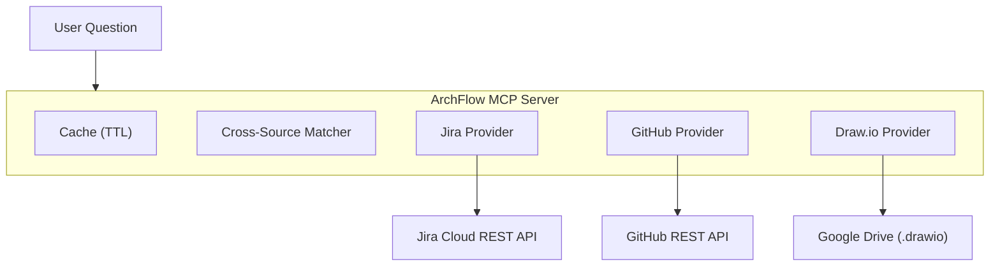

<p align="center">
  
</p>

<h1 align="center">ArchFlow</h1>

<p align="center">
  <strong>Jira + GitHub + Draw.io — one MCP server, one question</strong>
</p>

<p align="center">
  
  
  
  
  
</p>

<p align="center">
  <a href="#quick-start">Quick Start</a> ·
  <a href="#tools">Tools (23)</a> ·
  <a href="#slash-commands">Commands</a> ·
  <a href="#configuration-guide">Config</a> ·
  <a href="#contributing">Contributing</a> ·
  <a href="./README.ko.md">한국어</a>
</p>

---

## What is ArchFlow?

ArchFlow is an MCP (Model Context Protocol) server that lets your LLM query **Jira**, **GitHub**, and **Draw.io** diagrams in a single conversation. Ask about sprint progress, trace issues to code, or explore system architecture — all without switching tabs.

### Who is this for?

| Role | Example Question |
|------|-----------------|
| **CEO / PM** | "What's the sprint progress?" · "Weekly team report" |
| **New team member** | "Explain our system architecture" · "What should I look at first?" |
| **Developer** | "Where's the code for KAN-123?" · "Which PRs are related to auth?" |

### Demo

```
You: "Where's the code for KAN-42?"

ArchFlow traces across 3 sources:
  ✓ Jira  → KAN-42: "Add OAuth2 login" (In Progress, @alice)
  ✓ GitHub → PR #87 "feat: oauth2 login flow" (src/auth/oauth.ts)
  ✓ Draw.io → Auth Service node → connected to API Gateway, User DB
```

---

## Quick Start

### Prerequisites

| Tool | Check | Install |
|------|-------|---------|
| Python 3.11+ | `python --version` | [python.org](https://python.org) |
| uv | `uv --version` | See below |
| Claude Code | Already using it | [claude.ai/code](https://claude.ai/code) |

<details>
<summary><strong>Install uv</strong></summary>

```bash
# macOS / Linux
curl -LsSf https://astral.sh/uv/install.sh | sh

# Windows (PowerShell)
powershell -ExecutionPolicy ByPass -c "irm https://astral.sh/uv/install.ps1 | iex"
```

</details>

### Automated Install (recommended)

```bash
# 1. Clone
git clone https://github.com/your-org/archflow.git
cd archflow

# 2. Run installer
# macOS / Linux
bash scripts/install.sh

# Windows (PowerShell)
powershell -ExecutionPolicy Bypass -File scripts\install.ps1

# 3. Edit project config (set your Jira projects, GitHub repos)
code archflow.config.yml    # or any editor

# 4. Restart Claude Code — done!
```

> **Partial setup OK** — GitHub or Google Drive credentials can be skipped. ArchFlow works with whatever sources are configured.

<details>
<summary><strong>Manual Install (without script)</strong></summary>

If you prefer to set things up manually or the script doesn't work on your system:

```bash
# 1. Install dependencies
cd archflow
uv sync          # or: pip install -e .

# 2. Copy config template
cp archflow.config.example.yml archflow.config.yml
# Edit archflow.config.yml with your projects/repos
```

**3. Register MCP server** — add this to `~/.claude/.mcp.json` (create the file if it doesn't exist):

```jsonc
{
  "mcpServers": {
    "archflow": {
      "command": "uv",
      "args": ["--directory", "/absolute/path/to/archflow", "run", "archflow"],
      "env": {
        "PYTHONUNBUFFERED": "1",
        "ARCHFLOW_CONFIG_PATH": "/absolute/path/to/archflow/archflow.config.yml",

        // Jira (required for Jira features)
        "JIRA_INSTANCE_URL": "https://your-domain.atlassian.net",
        "JIRA_USER_EMAIL": "you@example.com",
        "JIRA_API_KEY": "your-jira-api-token",

        // GitHub (optional)
        "GITHUB_PERSONAL_ACCESS_TOKEN": "ghp_xxxxxxxxxxxx",

        // Google Drive / Draw.io (optional)
        "GOOGLE_CLIENT_ID": "...",
        "GOOGLE_CLIENT_SECRET": "...",
        "GOOGLE_REFRESH_TOKEN": "..."
      }
    }
  }
}
```

> **MCP config file location**:
> - macOS / Linux: `~/.claude/.mcp.json`
> - Windows: `C:\Users\<username>\.claude\.mcp.json`

**4. Install slash commands** (optional):

```bash
# Copy skill files to Claude Code skills directory
# macOS / Linux
cp -r skills/archflow-* ~/.claude/skills/

# Windows (PowerShell)
Copy-Item -Recurse skills\archflow-* $env:USERPROFILE\.claude\skills\
```

**5. Restart Claude Code.**

</details>

---

## Tools

### Jira (7)

| Tool | What it does |
|------|-------------|
| `archflow_jira_get_issue` | Full issue detail (comments, links, subtasks) |
| `archflow_jira_sprint_status` | Current sprint grouped by status |
| `archflow_jira_search` | JQL search |
| `archflow_jira_user_workload` | Issues assigned to a specific user |
| `archflow_jira_component_status` | Component progress with % done |
| `archflow_jira_recent_activity` | Recently updated issues (last N days) |
| `archflow_jira_epic_progress` | Epic children + completion rate |

### GitHub (6)

| Tool | What it does |
|------|-------------|
| `archflow_github_get_pr` | PR detail with diff stats |
| `archflow_github_list_prs` | List PRs (filter by state/author/branch) |
| `archflow_github_pr_for_issue` | Find PRs referencing a Jira issue key |
| `archflow_github_recent_commits` | Recent commits on a branch |
| `archflow_github_search_code` | Code search in a repo |
| `archflow_github_repo_overview` | Repo summary (language, activity) |

### Draw.io / Architecture (4)

| Tool | What it does |
|------|-------------|
| `archflow_drawio_list_diagrams` | List .drawio files from Google Drive |
| `archflow_drawio_get_diagram` | Parse diagram into nodes + edges |
| `archflow_drawio_search_nodes` | Search nodes by label |
| `archflow_drawio_node_connections` | Get a node's inbound/outbound connections |

### Cross-Source Intelligence (5)

| Tool | What it does |
|------|-------------|
| `archflow_trace_issue` | Issue → PRs + code + diagram nodes |
| `archflow_trace_component` | Architecture component → issues + PRs + connections |
| `archflow_project_overview` | Sprint + architecture + GitHub activity combined |
| `archflow_team_activity` | Weekly team report across all sources |
| `archflow_onboarding_context` | Everything a new member needs to know |

### Unified Search (1)

| Tool | What it does |
|------|-------------|
| `archflow_search` | Search across Jira + GitHub + diagrams at once |

### Which sources does each tool need?

| Tool group | Jira | GitHub | Draw.io |
|-----------|:----:|:------:|:-------:|
| Jira tools | **Required** | — | — |
| GitHub tools | — | **Required** | — |
| Draw.io tools | — | — | **Required** |
| Cross-Source (trace, overview) | **Required** | Optional | Optional |
| Unified Search | Optional | Optional | Optional |

If a source is not configured, those tools return a "not configured" message instead of crashing.

---

## Slash Commands

After installation, use these in Claude Code:

| Command | For | Example |
|---------|-----|---------|
| `/status` | Everyone | "How far is the auth feature?" |
| `/trace` | Developers | "Where's the code for KAN-123?" |
| `/arch` | Everyone | "What connects to Auth Service?" |
| `/onboard` | New members | "Give me a project overview" |
| `/report` | CEO / PM | "Weekly team activity report" |
| `/search` | Everyone | "Find everything related to Redis" |

---

## Configuration Guide

### Step 1: `archflow.config.yml`

After running the installer, edit `archflow.config.yml` in the project root:

```yaml
jira:
  url: "https://your-domain.atlassian.net"
  projects:
    - "KAN"              # your Jira project key(s)
  board_id: "1"          # see "How to find board_id" below

github:
  repos:
    - "your-org/backend-api"     # owner/repo format
  default_branch: "main"

gdrive:
  folder_id: "1AbCdEfG..."      # see "How to find folder_id" below
  cache_ttl_minutes: 30
```

#### How to find `board_id`

1. Open your Jira board in a browser
2. Look at the URL:
   ```
   https://your-domain.atlassian.net/jira/software/projects/KAN/boards/1
                                                                       ^
                                                                  this is board_id
   ```
3. Copy the number after `/boards/`

#### How to find `folder_id` (Google Drive)

1. Open the Google Drive folder that contains your `.drawio` files
2. Look at the URL:
   ```
   https://drive.google.com/drive/folders/1AbCdEfGhIjKlMnOpQrStUvWxYz
                                          ^^^^^^^^^^^^^^^^^^^^^^^^^^^^
                                          this is folder_id
   ```
3. Copy everything after `/folders/`

### Step 2: Environment Variables (API Tokens)

These are set automatically by the install script. If you need to set them manually:

| Variable | For | How to get |
|----------|-----|-----------|
| `JIRA_INSTANCE_URL` | Jira | Your Atlassian URL (e.g., `https://team.atlassian.net`) |
| `JIRA_USER_EMAIL` | Jira | Your Atlassian email |
| `JIRA_API_KEY` | Jira | [Create Jira token →](#jira-api-token) |
| `GITHUB_PERSONAL_ACCESS_TOKEN` | GitHub | [Create GitHub token →](#github-personal-access-token) |
| `GOOGLE_CLIENT_ID` | Draw.io | [Setup Google OAuth →](#google-drive-oauth) |
| `GOOGLE_CLIENT_SECRET` | Draw.io | Google Cloud Console |
| `GOOGLE_REFRESH_TOKEN` | Draw.io | OAuth flow |

> **Aliases**: `JIRA_URL`, `JIRA_EMAIL`, `JIRA_API_TOKEN` also work (the install script uses `JIRA_INSTANCE_URL` / `JIRA_USER_EMAIL` / `JIRA_API_KEY`).
>
> **Google Drive**: All 3 variables (`CLIENT_ID`, `CLIENT_SECRET`, `REFRESH_TOKEN`) must be set together. If any is missing, Draw.io features are disabled.

### Token Setup

<details>
<summary><strong>Jira API Token</strong> (2 min)</summary>

1. Go to https://id.atlassian.com/manage-profile/security/api-tokens
2. Click **"Create API token"** → enter label (e.g., `archflow`)
3. Copy token → paste into installer or `.mcp.json`

</details>

<details>
<summary><strong>GitHub Personal Access Token</strong> (2 min)</summary>

1. Go to https://github.com/settings/tokens?type=beta
2. **Generate new token** → name it `archflow`
3. Permissions → Repository: **Contents**, **Pull requests**, **Metadata** (all Read-only)
4. Copy token → paste into installer or `.mcp.json`

</details>

<details>
<summary><strong>Google Drive OAuth</strong> (10 min — only for Draw.io)</summary>

1. [Google Cloud Console](https://console.cloud.google.com/) → create/select project
2. **APIs & Services > Library** → enable **Google Drive API**
3. **Credentials** → Create **OAuth client ID** (Desktop app)
4. Copy **Client ID** and **Client Secret**
5. Get Refresh Token via [OAuth Playground](https://developers.google.com/oauthplayground/):
   - Settings → "Use your own OAuth credentials" → enter Client ID/Secret
   - Step 1: Select `drive.readonly` scope → Authorize
   - Step 2: Exchange → copy **Refresh token**

</details>

---

## Architecture

<p align="center">
  
</p>

**Token efficiency**: All API responses are cached with configurable TTL. Repeated questions = 0 API calls.

<details>
<summary>Mermaid (text version)</summary>



</details>

---

## Troubleshooting

### Setup Checklist

Run these to verify your setup is working:

```bash
# 1. Check Python version (need 3.11+)
python --version

# 2. Check MCP config is valid JSON
python -m json.tool ~/.claude/.mcp.json          # macOS/Linux
python -m json.tool %USERPROFILE%\.claude\.mcp.json   # Windows

# 3. Check server starts without errors
cd archflow && uv run archflow
# (Ctrl+C to stop — if no errors, it works)
```

### Common Issues

| Problem | Cause | Solution |
|---------|-------|----------|
| Server not in Claude Code | MCP config not registered | Run install script again, or add manually to `.mcp.json` ([see manual install](#manual-install-without-script)) |
| `"Jira not configured"` | `JIRA_INSTANCE_URL` env var missing | Check `.mcp.json` → `archflow.env` has all 3 Jira variables |
| `"GitHub not configured"` | `GITHUB_PERSONAL_ACCESS_TOKEN` missing | Add to `.mcp.json` → `archflow.env` |
| Draw.io files not found | Wrong `folder_id` or missing OAuth tokens | Check `folder_id` in config ([how to find →](#how-to-find-folder_id-google-drive)) and all 3 Google env vars |
| Stale data | API responses cached | Default TTL is 30 min. Restart Claude Code to clear cache |
| GitHub rate limit | Search API: 30 req/min | Wait a minute — results are cached automatically |
| `bash: command not found` (Windows) | Ran bash script in PowerShell/CMD | Use `powershell -ExecutionPolicy Bypass -File scripts\install.ps1` instead |
| `SyntaxError` on server start | Wrong Python version | Check `python --version` — need 3.11+ |
| MCP config parse error | Invalid JSON in `.mcp.json` | Run `python -m json.tool ~/.claude/.mcp.json` to find the error |

---

## Contributing

### Project Structure

```
src/archflow/
├── server.py          # MCP server entry point + lifespan
├── clients/           # HTTP clients
│   ├── jira_client.py       # Jira REST API calls
│   ├── github_client.py     # GitHub REST API calls
│   └── gdrive_client.py     # Google Drive API calls
├── providers/         # Business logic per source
│   ├── jira_provider.py     # Jira data processing
│   ├── github_provider.py   # GitHub data processing
│   └── drawio_provider.py   # Draw.io XML parsing + data processing
├── core/              # Shared infrastructure
│   ├── config.py            # YAML config loader
│   ├── cache.py             # TTL cache
│   ├── matcher.py           # Cross-source matching engine
│   └── models.py            # Pydantic models
└── tools/             # MCP tool registrations (23 tools)
    ├── jira_tools.py        # 7 Jira tools
    ├── github_tools.py      # 6 GitHub tools
    ├── drawio_tools.py      # 4 Draw.io tools
    ├── cross_tools.py       # 5 cross-source tools
    └── search_tools.py      # 1 unified search tool
```

### Development Setup

```bash
uv sync --dev                          # install dev dependencies
uv run python -m pytest tests/ -v      # run tests
uv run ruff check src/                 # lint
```

### Where to Start

| Want to... | Look at |
|-----------|---------|
| Add a new Jira tool | `src/archflow/tools/jira_tools.py` |
| Add a new GitHub tool | `src/archflow/tools/github_tools.py` |
| Change how sources are matched | `src/archflow/core/matcher.py` |
| Add a new data source | Create `clients/X_client.py` + `providers/X_provider.py` + `tools/X_tools.py` |
| Modify caching behavior | `src/archflow/core/cache.py` |

### Commit Convention

```
<type>: <description>

Types: feat | fix | refactor | docs | test | chore | perf | ci
```

---

## License

MIT — see [LICENSE](LICENSE) for details.
