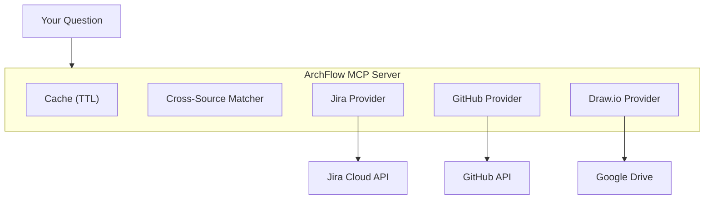

<p align="center">
  
</p>

<h1 align="center">ArchFlow</h1>

<p align="center">
  <strong>Jira + GitHub + Draw.io — one MCP server, one question</strong>
</p>

<p align="center">
  
  
  
  
</p>

<p align="center">
  <a href="#install">Install</a> ·
  <a href="#what-you-can-do">What You Can Do</a> ·
  <a href="#commands">Commands</a> ·
  <a href="#configuration">Configuration</a> ·
  <a href="#contributing">Contributing</a> ·
  <a href="./README.ko.md">한국어</a>
</p>

---

## Why ArchFlow?

You're in Claude Code. You want to know where KAN-42 is at. Instead of opening Jira, then GitHub, then a diagram — you just ask:

```
You: "Where's the code for KAN-42?"

ArchFlow:
  Jira   → KAN-42: "Add OAuth2 login" (In Progress, @alice)
  GitHub → PR #87 "feat: oauth2 login flow" (src/auth/oauth.ts)
  Draw.io → Auth Service → connected to API Gateway, User DB
```

One question. Three sources. Zero tab-switching.

---

## Install

```bash
pip install archflow-hub
archflow init
```

Done. `archflow init` does everything:

1. Validates your API tokens (Jira, GitHub, Google Drive)
2. Saves config to `~/.archflow/config.yml`
3. Registers the MCP server in Claude Code
4. Installs slash commands (`/status`, `/trace`, `/arch`, `/onboard`, `/report`, `/search`)

Restart Claude Code and you're ready.

```bash
archflow doctor    # verify connections anytime
```

> GitHub and Google Drive are optional. ArchFlow works with whatever you configure.

---

## What You Can Do

### For everyone

| Ask this | ArchFlow does this |
|----------|-------------------|
| "How's the sprint going?" | Pulls active sprint from Jira, groups by status, shows % done |
| "Find everything about Redis" | Searches Jira issues + GitHub code + diagram nodes at once |
| "What connects to Auth Service?" | Parses Draw.io diagram, shows inbound/outbound connections |

### For developers

| Ask this | ArchFlow does this |
|----------|-------------------|
| "Where's the code for KAN-42?" | Traces Jira issue → GitHub PRs → code files → architecture nodes |
| "Show me open PRs for auth" | Searches GitHub PRs by keyword, branch, or linked Jira key |
| "What did the team ship this week?" | Aggregates commits, PRs, and Jira transitions into one report |

### For managers / new members

| Ask this | ArchFlow does this |
|----------|-------------------|
| "Weekly team report" | Cross-source activity: who did what, what moved, what's blocked |
| "I just joined — give me context" | Sprint overview + architecture diagram + repo structure + key issues |
| "How far is the auth epic?" | Epic children with completion %, broken down by status |

---

## Commands

After install, these slash commands work in Claude Code:

| Command | What it does |
|---------|-------------|
| `/status` | Sprint progress, issue status, component completion |
| `/trace` | Issue → PR → code → architecture tracing |
| `/arch` | Architecture diagram queries and connections |
| `/onboard` | Full project context for new team members |
| `/report` | Weekly team activity report |
| `/search` | Unified search across all sources |

You can also just ask naturally — ArchFlow's 23 MCP tools are available to Claude directly.

---

## Configuration

### `~/.archflow/config.yml`

Generated by `archflow init`. Edit anytime:

```yaml
jira:
  url: "https://your-domain.atlassian.net"
  projects: ["KAN"]
  board_id: "1"

github:
  repos: ["your-org/your-repo"]
  default_branch: "main"

gdrive:
  folder_id: "1AbCdEfG..."     # Google Drive folder with .drawio files
  cache_ttl_minutes: 30
```

### API Tokens

`archflow init` prompts for these interactively. For reference:

| Token | How to get |
|-------|-----------|
| Jira API Token | [id.atlassian.com/manage-profile/security/api-tokens](https://id.atlassian.com/manage-profile/security/api-tokens) |
| GitHub PAT | [github.com/settings/tokens](https://github.com/settings/tokens?type=beta) — needs `Contents`, `Pull requests`, `Metadata` (read-only) |
| Google OAuth | [console.cloud.google.com](https://console.cloud.google.com/) — enable Drive API, create OAuth Desktop credentials |

<details>
<summary><strong>Google Drive OAuth setup (10 min)</strong></summary>

1. Google Cloud Console → create/select project
2. **APIs & Services > Library** → enable **Google Drive API**
3. **Credentials** → Create **OAuth client ID** (Desktop app)
4. Copy **Client ID** and **Client Secret**
5. Get Refresh Token via [OAuth Playground](https://developers.google.com/oauthplayground/):
   - Settings → "Use your own OAuth credentials" → enter Client ID/Secret
   - Step 1: Select `drive.readonly` scope → Authorize
   - Step 2: Exchange → copy **Refresh token**

</details>

<details>
<summary><strong>How to find board_id / folder_id</strong></summary>

**Jira board_id**: Open your board → look at URL:
```
https://your-domain.atlassian.net/jira/software/projects/KAN/boards/1
                                                                    ^
```

**Google Drive folder_id**: Open the folder → look at URL:
```
https://drive.google.com/drive/folders/1AbCdEfGhIjKlMnOpQrStUvWxYz
                                       ^^^^^^^^^^^^^^^^^^^^^^^^^^^^
```

</details>

<details>
<summary><strong>Manual install (without archflow init)</strong></summary>

```bash
pip install archflow-hub

claude mcp add-json archflow '{
  "command": "uvx",
  "args": ["archflow-hub"],
  "env": {
    "PYTHONUNBUFFERED": "1",
    "ARCHFLOW_CONFIG_PATH": "~/.archflow/config.yml",
    "JIRA_URL": "https://your-domain.atlassian.net",
    "JIRA_EMAIL": "you@example.com",
    "JIRA_API_TOKEN": "your-jira-api-token",
    "GITHUB_PERSONAL_ACCESS_TOKEN": "ghp_xxxxxxxxxxxx"
  }
}'
```

</details>

---

## Architecture

<p align="center">
  
</p>



All API responses are cached (default 30 min TTL). Repeated questions cost zero API calls.

---

## Troubleshooting

```bash
archflow doctor    # checks everything: Python, config, APIs, MCP registration
```

| Problem | Solution |
|---------|----------|
| Server not showing in Claude Code | `archflow init` or check `~/.claude/.mcp.json` |
| "Jira not configured" | Verify Jira env vars in `.mcp.json` |
| "GitHub not configured" | Add `GITHUB_PERSONAL_ACCESS_TOKEN` to `.mcp.json` |
| Draw.io files not found | Check `folder_id` in config + all 3 Google env vars |
| Stale data | Restart Claude Code (clears 30 min cache) |
| GitHub rate limit (30 req/min) | Wait — results are cached automatically |

---

## Contributing

### Project Structure

```
src/archflow/
├── server.py              # MCP server + tool registration
├── cli.py                 # CLI: init, doctor, serve
├── cli_init.py            # Setup wizard (tokens + MCP + skills)
├── cli_doctor.py          # Connection diagnostics
├── clients/               # API clients (Jira, GitHub, Google Drive)
├── providers/             # Business logic per source
├── core/                  # Config, cache, matcher, models
├── tools/                 # 23 MCP tools
└── skills/                # 6 slash command definitions
```

### Dev Setup

```bash
git clone https://github.com/Juhwan01/ArchFlow.git
cd ArchFlow
uv sync --dev
uv run python -m pytest tests/ -v
uv run ruff check src/
```

### Commit Convention

```
<type>: <description>
Types: feat | fix | refactor | docs | test | chore | perf | ci
```

---

## License

MIT — see [LICENSE](LICENSE) for details.
