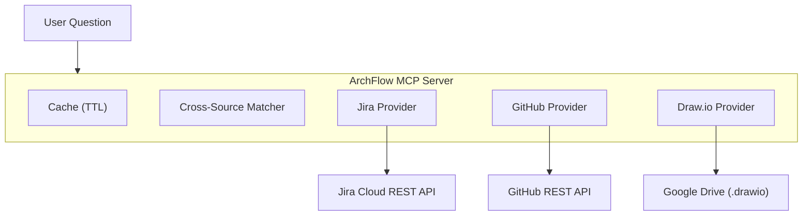

<p align="center">
  
</p>

<h1 align="center">ArchFlow</h1>

<p align="center">
  <strong>Jira + GitHub + Draw.io — one MCP server, one question</strong>
</p>

<p align="center">
  
  
  
  
  
</p>

<p align="center">
  <a href="#quick-start">Quick Start</a> ·
  <a href="#tools">Tools (23)</a> ·
  <a href="#slash-commands">Commands</a> ·
  <a href="#configuration">Config</a> ·
  <a href="#contributing">Contributing</a> ·
  <a href="./README.ko.md">한국어</a>
</p>

---

## What is ArchFlow?

ArchFlow is an MCP (Model Context Protocol) server that lets your LLM query **Jira**, **GitHub**, and **Draw.io** diagrams in a single conversation. Ask about sprint progress, trace issues to code, or explore system architecture — all without switching tabs.

### Who is this for?

| Role | Example Question |
|------|-----------------|
| **CEO / PM** | "What's the sprint progress?" · "Weekly team report" |
| **New team member** | "Explain our system architecture" · "What should I look at first?" |
| **Developer** | "Where's the code for KAN-123?" · "Which PRs are related to auth?" |

### Demo

```
You: "KAN-42 관련 코드 어디에 있어?"

ArchFlow traces across 3 sources:
  ✓ Jira  → KAN-42: "Add OAuth2 login" (In Progress, @alice)
  ✓ GitHub → PR #87 "feat: oauth2 login flow" (src/auth/oauth.ts)
  ✓ Draw.io → Auth Service node → connected to API Gateway, User DB
```

---

## Quick Start

> **Prerequisites**: Python 3.11+ · [uv](https://docs.astral.sh/uv/) · Claude Code CLI

```bash
# 1. Clone & install
git clone https://github.com/your-org/archflow.git
cd archflow
bash scripts/install.sh    # interactive — asks for API credentials

# 2. Edit project config
code archflow.config.yml   # or any editor

# 3. Restart Claude Code — done!
```

The installer handles: dependencies, credential setup, MCP registration, and slash commands.

> **Partial setup OK** — GitHub or Google Drive credentials can be skipped. ArchFlow works with whatever sources are configured.

---

## Tools

### Jira (7)

| Tool | What it does |
|------|-------------|
| `archflow_jira_get_issue` | Full issue detail (comments, links, subtasks) |
| `archflow_jira_sprint_status` | Current sprint grouped by status |
| `archflow_jira_search` | JQL search |
| `archflow_jira_user_workload` | Issues assigned to a specific user |
| `archflow_jira_component_status` | Component progress with % done |
| `archflow_jira_recent_activity` | Recently updated issues (last N days) |
| `archflow_jira_epic_progress` | Epic children + completion rate |

### GitHub (6)

| Tool | What it does |
|------|-------------|
| `archflow_github_get_pr` | PR detail with diff stats |
| `archflow_github_list_prs` | List PRs (filter by state/author/branch) |
| `archflow_github_pr_for_issue` | Find PRs referencing a Jira issue key |
| `archflow_github_recent_commits` | Recent commits on a branch |
| `archflow_github_search_code` | Code search in a repo |
| `archflow_github_repo_overview` | Repo summary (language, activity) |

### Draw.io / Architecture (4)

| Tool | What it does |
|------|-------------|
| `archflow_drawio_list_diagrams` | List .drawio files from Google Drive |
| `archflow_drawio_get_diagram` | Parse diagram into nodes + edges |
| `archflow_drawio_search_nodes` | Search nodes by label |
| `archflow_drawio_node_connections` | Get a node's inbound/outbound connections |

### Cross-Source Intelligence (5)

| Tool | What it does |
|------|-------------|
| `archflow_trace_issue` | Issue → PRs + code + diagram nodes |
| `archflow_trace_component` | Architecture component → issues + PRs + connections |
| `archflow_project_overview` | Sprint + architecture + GitHub activity combined |
| `archflow_team_activity` | Weekly team report across all sources |
| `archflow_onboarding_context` | Everything a new member needs to know |

### Unified Search (1)

| Tool | What it does |
|------|-------------|
| `archflow_search` | Search across Jira + GitHub + diagrams at once |

---

## Slash Commands

After installation, use these in Claude Code:

| Command | For | Example |
|---------|-----|---------|
| `/status` | Everyone | "How far is the auth feature?" |
| `/trace` | Developers | "Where's the code for KAN-123?" |
| `/arch` | Everyone | "What connects to Auth Service?" |
| `/onboard` | New members | "Give me a project overview" |
| `/report` | CEO / PM | "Weekly team activity report" |
| `/search` | Everyone | "Find everything related to Redis" |

---

## Configuration

### `archflow.config.yml`

```yaml
jira:
  url: "https://your-domain.atlassian.net"
  projects:
    - "KAN"              # multiple projects supported
    - "FRONT"
  board_id: "1"

github:
  repos:
    - "your-org/backend-api"     # multiple repos supported
    - "your-org/frontend-web"
  default_branch: "main"

gdrive:
  folder_id: "1abc123..."       # Google Drive folder with .drawio files
  cache_ttl_minutes: 30

matching:
  explicit:                      # manual: diagram node → Jira/GitHub mapping
    - diagram_node: "Auth Service"
      jira_component: "authentication"
      github_path_prefix: "src/auth/"
  auto_match:
    enabled: true
    strategy: "fuzzy"            # exact | fuzzy | contains
    min_score: 0.7
```

### Environment Variables

| Variable | When needed | Where to get it |
|----------|------------|-----------------|
| `JIRA_URL` | Jira features | Your Atlassian URL |
| `JIRA_EMAIL` | Jira features | Your email |
| `JIRA_API_TOKEN` | Jira features | [Create token →](#jira-api-token) |
| `GITHUB_PERSONAL_ACCESS_TOKEN` | GitHub features | [Create token →](#github-personal-access-token) |
| `GOOGLE_CLIENT_ID` | Draw.io features | [Setup OAuth →](#google-drive-oauth) |
| `GOOGLE_CLIENT_SECRET` | Draw.io features | Google Cloud Console |
| `GOOGLE_REFRESH_TOKEN` | Draw.io features | OAuth flow |

> Also accepts `JIRA_INSTANCE_URL`, `JIRA_USER_EMAIL`, `JIRA_API_KEY` as aliases.

### Token Setup

<details>
<summary><strong>Jira API Token</strong> (2 min)</summary>

1. Go to https://id.atlassian.com/manage-profile/security/api-tokens
2. Click **"Create API token"** → enter label (e.g., `archflow`)
3. Copy token → paste into installer

</details>

<details>
<summary><strong>GitHub Personal Access Token</strong> (2 min)</summary>

1. Go to https://github.com/settings/tokens?type=beta
2. **Generate new token** → name it `archflow`
3. Permissions → Repository: **Contents**, **Pull requests**, **Metadata** (all Read-only)
4. Copy token → paste into installer

</details>

<details>
<summary><strong>Google Drive OAuth</strong> (10 min — only for Draw.io)</summary>

1. [Google Cloud Console](https://console.cloud.google.com/) → create/select project
2. **APIs & Services > Library** → enable **Google Drive API**
3. **Credentials** → Create **OAuth client ID** (Desktop app)
4. Copy **Client ID** and **Client Secret**
5. Get Refresh Token via [OAuth Playground](https://developers.google.com/oauthplayground/):
   - Settings → "Use your own OAuth credentials" → enter Client ID/Secret
   - Step 1: Select `drive.readonly` scope → Authorize
   - Step 2: Exchange → copy **Refresh token**

</details>

---

## Architecture



**Token efficiency**: All API responses are cached with configurable TTL. Repeated questions = 0 API calls.

---

## Troubleshooting

| Problem | Solution |
|---------|----------|
| Server not in Claude Code | Check JSON syntax: `python3 -m json.tool ~/.claude/.mcp.json` |
| "Jira not configured" | Verify `JIRA_URL` env var is set |
| "GitHub not configured" | Set `GITHUB_PERSONAL_ACCESS_TOKEN` in MCP config |
| Draw.io files not found | Verify `folder_id` + Google OAuth tokens |
| Stale data | Default cache TTL is 30 min. Restart server to clear |
| GitHub rate limit | Search API: 30 req/min. Results are cached automatically |

```bash
# Validate setup
python3 -m json.tool ~/.claude/.mcp.json   # config syntax
cd archflow && uv run archflow              # server starts? (Ctrl+C)
uv run python -m pytest tests/ -v           # run tests
```

---

## Contributing

### Project Structure

```
src/archflow/
├── server.py          # MCP server entry point + lifespan
├── clients/           # HTTP clients (Jira, GitHub, Google Drive)
│   ├── jira_client.py
│   ├── github_client.py
│   └── gdrive_client.py
├── providers/         # Business logic per source
│   ├── jira_provider.py
│   ├── github_provider.py
│   └── drawio_provider.py
├── core/              # Config, cache, matcher, models
│   ├── config.py
│   ├── cache.py
│   ├── matcher.py
│   └── models.py
└── tools/             # MCP tool registrations (23 tools)
    ├── jira_tools.py
    ├── github_tools.py
    ├── drawio_tools.py
    ├── cross_tools.py
    └── search_tools.py
```

### Development Setup

```bash
# Install dev dependencies
uv sync --dev

# Run tests
uv run python -m pytest tests/ -v

# Lint
uv run ruff check src/
```

### Where to Start

| Want to... | Look at |
|-----------|---------|
| Add a new Jira tool | `src/archflow/tools/jira_tools.py` |
| Add a new GitHub tool | `src/archflow/tools/github_tools.py` |
| Change how sources are matched | `src/archflow/core/matcher.py` |
| Add a new data source | Create `clients/X_client.py` + `providers/X_provider.py` + `tools/X_tools.py` |
| Modify caching behavior | `src/archflow/core/cache.py` |

### Commit Convention

```
<type>: <description>

Types: feat | fix | refactor | docs | test | chore | perf | ci
```

---

## License

MIT — see [LICENSE](LICENSE) for details.
