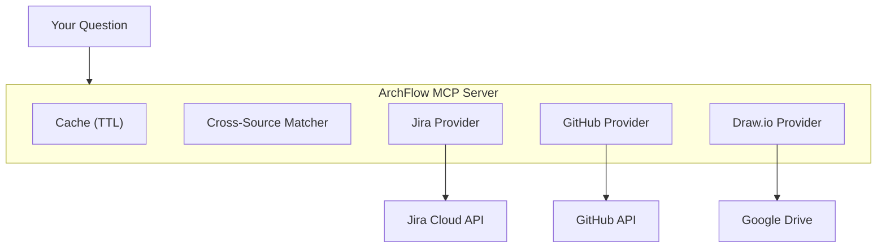

<p align="center">
  
</p>

<h1 align="center">ArchFlow</h1>

<p align="center">
  <strong>Jira + GitHub + Draw.io — one MCP server, one question</strong>
</p>

<p align="center">
  
  
  
  
</p>

<p align="center">
  <a href="#install">Install</a> ·
  <a href="#what-you-can-do">What You Can Do</a> ·
  <a href="#slash-commands">Commands</a> ·
  <a href="#configuration">Configuration</a> ·
  <a href="#architecture">Architecture</a> ·
  <a href="#contributing">Contributing</a> ·
  <a href="./README.ko.md">한국어</a>
</p>

---

## What is ArchFlow?

ArchFlow is an [MCP (Model Context Protocol)](https://modelcontextprotocol.io/) server that connects **Jira**, **GitHub**, and **Draw.io** diagrams to your AI coding assistant. Ask about sprint progress, trace issues to code, or explore system architecture — all in one conversation, without switching tabs.

```
You: "Where's the code for KAN-42?"

ArchFlow:
  Jira   → KAN-42: "Add OAuth2 login" (In Progress, @alice)
  GitHub → PR #87 "feat: oauth2 login flow" (src/auth/oauth.ts)
  Draw.io → Auth Service → connected to API Gateway, User DB
```

### Who is this for?

| Role | Example |
|------|---------|
| **CEO / PM** | "What's the sprint progress?" · "Weekly team report" |
| **New team member** | "Explain our system architecture" · "What should I look at first?" |
| **Developer** | "Where's the code for KAN-123?" · "Which PRs are related to auth?" |

---

## Install

### Prerequisites

- **Python 3.11+** — [download](https://www.python.org/downloads/)
- **Claude Code** — must be installed and working
- **Jira Cloud account** (required) — GitHub and Google Drive are optional

### Quick Start (2 commands)

```bash
# 1. Install the package
pip install archflow-hub

# 2. Interactive setup — validates tokens, generates config, registers MCP, installs slash commands
archflow init
```

`archflow init` walks you through everything interactively:

```
Jira URL           → https://your-team.atlassian.net
Jira email         → you@company.com
Jira API token     → ********  (validated automatically)
Jira project key   → KAN
Jira board ID      → 1
GitHub token       → ********  (optional, Enter to skip)
Google Drive       → (optional, Enter to skip)
```

After completion, **restart Claude Code** and try `/archflow-status` or `/archflow-onboard`.

### Health Check

```bash
archflow doctor    # verify all connections
```

### Install Methods

| Method | Description | When to use |
|--------|-------------|-------------|
| `pip install archflow-hub` | Installs globally | To run `archflow init` and `archflow doctor` from terminal |
| `uvx archflow-hub` | Runs without installing (like npx) | Used internally by Claude Code to start the MCP server |
| `uv tool install archflow-hub` | Installs globally via uv | Alternative to pip if you use uv |

> After `archflow init`, Claude Code automatically runs the MCP server via `uvx` — no additional setup needed.

---

## What You Can Do

### For everyone

| Ask this | ArchFlow does this |
|----------|-------------------|
| "How's the sprint going?" | Pulls active sprint from Jira, groups by status, shows % done |
| "Find everything about Redis" | Searches Jira issues + GitHub code + diagram nodes at once |
| "What connects to Auth Service?" | Parses Draw.io diagram, shows inbound/outbound connections |

### For developers

| Ask this | ArchFlow does this |
|----------|-------------------|
| "Where's the code for KAN-42?" | Traces Jira issue → GitHub PRs → code files → architecture nodes |
| "Show me open PRs for auth" | Searches GitHub PRs by keyword, branch, or linked Jira key |
| "What did the team ship this week?" | Aggregates commits, PRs, and Jira transitions into one report |

### For managers / new members

| Ask this | ArchFlow does this |
|----------|-------------------|
| "Weekly team report" | Cross-source activity: who did what, what moved, what's blocked |
| "I just joined — give me context" | Sprint overview + architecture + repo structure + key issues |
| "How far is the auth epic?" | Epic children with completion %, broken down by status |

---

## Slash Commands

These work in Claude Code after install:

| Command | What it does |
|---------|-------------|
| `/archflow-status` | Sprint progress, issue status, component completion |
| `/archflow-trace` | Issue → PR → code → architecture tracing |
| `/archflow-arch` | Architecture diagram queries and connections |
| `/archflow-onboard` | Full project context for new team members |
| `/archflow-report` | Weekly team activity report |
| `/archflow-search` | Unified search across all sources |

> You can also ask naturally without slash commands — ArchFlow's 23 MCP tools are available to Claude directly.

---

## MCP Tools (23)

Under the hood, ArchFlow exposes 23 tools via the Model Context Protocol:

| Group | Count | Tools |
|-------|:-----:|-------|
| **Jira** | 7 | `get_issue`, `sprint_status`, `search`, `user_workload`, `component_status`, `recent_activity`, `epic_progress` |
| **GitHub** | 6 | `get_pr`, `list_prs`, `pr_for_issue`, `recent_commits`, `search_code`, `repo_overview` |
| **Draw.io** | 4 | `list_diagrams`, `get_diagram`, `search_nodes`, `node_connections` |
| **Cross-Source** | 5 | `trace_issue`, `trace_component`, `project_overview`, `team_activity`, `onboarding_context` |
| **Search** | 1 | `search` (unified across all sources) |

All tools are prefixed with `archflow_` (e.g., `archflow_jira_get_issue`).

### Source requirements

| Tool group | Jira | GitHub | Draw.io |
|-----------|:----:|:------:|:-------:|
| Jira tools | **Required** | — | — |
| GitHub tools | — | **Required** | — |
| Draw.io tools | — | — | **Required** |
| Cross-Source | **Required** | Optional | Optional |
| Unified Search | Optional | Optional | Optional |

If a source is not configured, those tools return a "not configured" message instead of crashing.

---

## Configuration

### Config file

Generated by `archflow init` at `~/.archflow/config.yml`. Edit anytime:

```yaml
jira:
  url: "https://your-team.atlassian.net"
  projects: ["KAN"]
  board_id: "1"

github:
  repos: ["your-org/your-repo"]
  default_branch: "main"

gdrive:
  folder_id: "1AbCdEfG..."
  cache_ttl_minutes: 30
```

### API Tokens

`archflow init` prompts for these interactively. For reference:

<details>
<summary><strong>Jira API Token</strong> (2 min)</summary>

1. Go to https://id.atlassian.com/manage-profile/security/api-tokens
2. Click **"Create API token"** → enter label (e.g., `archflow`)
3. Copy token → paste into `archflow init`

</details>

<details>
<summary><strong>GitHub Personal Access Token</strong> (2 min, optional)</summary>

1. Go to https://github.com/settings/tokens?type=beta
2. **Generate new token** → name it `archflow`
3. Permissions → Repository: **Contents**, **Pull requests**, **Metadata** (all Read-only)
4. Copy token → paste into `archflow init`

</details>

<details>
<summary><strong>Google Drive OAuth</strong> (10 min, optional — only for Draw.io)</summary>

1. [Google Cloud Console](https://console.cloud.google.com/) → create/select project
2. **APIs & Services > Library** → enable **Google Drive API**
3. **Credentials** → Create **OAuth client ID** (Desktop app)
4. Copy **Client ID** and **Client Secret**
5. Get Refresh Token via [OAuth Playground](https://developers.google.com/oauthplayground/):
   - Settings → "Use your own OAuth credentials" → enter Client ID/Secret
   - Step 1: Select `drive.readonly` scope → Authorize
   - Step 2: Exchange → copy **Refresh token**

</details>

<details>
<summary><strong>How to find board_id / folder_id</strong></summary>

**Jira board_id** — open your board, look at the URL:
```
https://your-team.atlassian.net/jira/software/projects/KAN/boards/1
                                                                  ^
```

**Google Drive folder_id** — open the folder, look at the URL:
```
https://drive.google.com/drive/folders/1AbCdEfGhIjKlMnOpQrStUvWxYz
                                       ^^^^^^^^^^^^^^^^^^^^^^^^^^^^
```

</details>

<details>
<summary><strong>Manual install (without archflow init)</strong></summary>

```bash
pip install archflow-hub

claude mcp add-json archflow '{
  "command": "uvx",
  "args": ["archflow-hub"],
  "env": {
    "PYTHONUNBUFFERED": "1",
    "ARCHFLOW_CONFIG_PATH": "~/.archflow/config.yml",
    "JIRA_URL": "https://your-domain.atlassian.net",
    "JIRA_EMAIL": "you@example.com",
    "JIRA_API_TOKEN": "your-jira-api-token",
    "GITHUB_PERSONAL_ACCESS_TOKEN": "ghp_xxxxxxxxxxxx"
  }
}'
```

> `claude mcp add` (without `-json`) does **not** pass environment variables.

</details>

---

## Architecture

<p align="center">
  
</p>



All API responses are cached (default 30 min TTL). Repeated questions cost zero API calls.

---

## Troubleshooting

```bash
archflow doctor    # checks Python, config, APIs, MCP registration
```

| Problem | Solution |
|---------|----------|
| Server not showing in Claude Code | Run `archflow init` again, then restart Claude Code |
| "Jira not configured" | Check Jira env vars in `~/.claude/.mcp.json` |
| "GitHub not configured" | Add `GITHUB_PERSONAL_ACCESS_TOKEN` to `.mcp.json` |
| Draw.io files not found | Check `folder_id` in config + all 3 Google env vars |
| Stale data | Restart Claude Code (clears 30 min cache) |
| GitHub rate limit | Wait a minute — results are cached automatically |

---

## Contributing

### Project Structure

```
src/archflow/
├── server.py              # MCP server + tool registration
├── cli.py                 # CLI: init, doctor, serve
├── cli_init.py            # Setup wizard (tokens + MCP + slash commands)
├── cli_doctor.py          # Connection diagnostics
├── clients/               # API clients (Jira, GitHub, Google Drive)
├── providers/             # Business logic per source
├── core/                  # Config, cache, matcher, models
├── tools/                 # 23 MCP tools
└── skills/                # 6 slash command definitions
```

### Dev Setup

```bash
git clone https://github.com/Juhwan01/ArchFlow.git
cd ArchFlow
uv sync --dev
uv run python -m pytest tests/ -v
uv run ruff check src/
```

### Commit Convention

```
<type>: <description>
Types: feat | fix | refactor | docs | test | chore | perf | ci
```

---

## License

MIT — see [LICENSE](LICENSE) for details.
